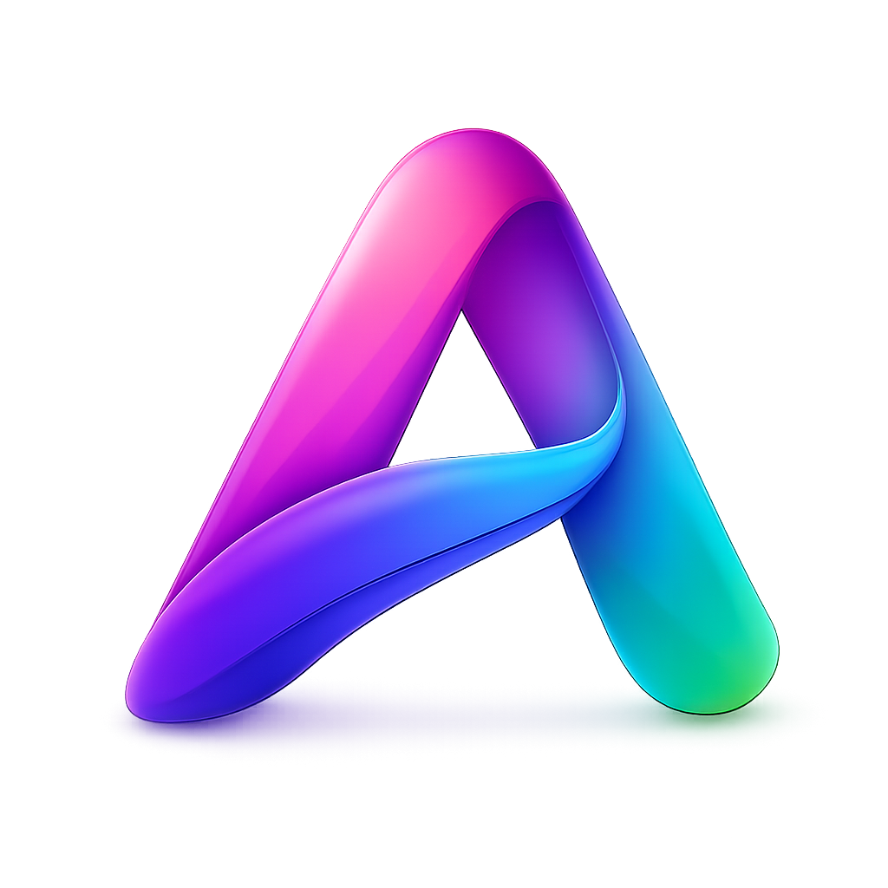

# AgnesStudio

<p align="center">
  
</p>
<b><span style="color:#e74c3c">AgnesStudio</span></b> 是一款大小仅有不到 6MB，基于 Rust + [Dioxus](https://dioxuslabs.com/) 构建的桌面客户端，为 [Agnes AI](https://agnes-ai.com/) 的图像与视频生成模型提供精美的图形化操作界面。

- 🖼 **图像生成**：支持 Agnes Image 2.1 Flash / 2.0 Flash，文生图与图生图
- 🎬 **视频生成**：支持 Agnes Video V2.0，文生视频、图生视频、多图视频、关键帧动画
- 🎨 **精致 GUI**：现代化界面，彩色渐变 logo，流畅交互
- 💾 **本地配置**：API Key、保存目录等配置保存在本机，重启不丢失
- 📐 **丰富尺寸**：内置多种预设（最高 4K），并支持自定义尺寸
- 🖥 **跨平台内核**：基于 Dioxus desktop，目前主要面向 Windows

---

## 链接

- **GitHub**：<https://github.com/LingyunStudio/AgnesStudio>
- **Agnes 官网**：<https://agnes-ai.com/>

---

## 功能特性

### 图像生成
- 两个模型一键切换，默认使用 **Agnes Image 2.1 Flash**
- 工作模式：**文生图**（Text to Image）/ **图生图**（Image to Image）
- 尺寸预设：1024×1024、1024×768、1280×720、1920×1080、2K、4K 等，并支持自定义
- 输出格式：URL / Base64
- 生成结果可直接在软件内预览、放大查看、一键保存到指定目录

### 视频生成
- 四种工作流：**文生视频**、**图生视频**、**多图视频**、**关键帧动画**
- 画面尺寸：16:9 横版、9:16 竖版、1:1 方形、4:3、3:4，支持自定义
- 时长 / 帧率 / 帧数可调
- 异步任务机制，自动轮询生成结果并内嵌播放器预览
- 支持保存为本地 MP4

### 通用
- **API Key 管理**：在「设置」中填写 Bearer Token，可显示/隐藏，保存在本机配置文件
- **保存目录**：可自定义并记忆，支持浏览选择
- **历史记录**：生成过的图像/视频可在底部历史栏快速回看
- **状态指示**：实时显示 API Key 状态与生成进度

---

## 截图


---

## 环境要求

- **Rust** 1.75+（推荐 stable 最新版）
- **Windows 10/11**（主要支持平台；WebView2 运行时，Win11 已自带）
- 构建时可执行文件图标嵌入需要以下任一工具（用于编译 Windows 资源）：
  - MinGW-w64 的 `windres`（推荐，MSVC 工具链也可用其生成 `.res`）
  - 或 Windows SDK 的 `rc.exe` / LLVM 的 `llvm-rc`

> 若环境中没有任何资源编译器，软件仍可正常构建运行，仅 exe 在资源管理器中不显示自定义图标（应用内与窗口标题栏图标不受影响）。

---

## 构建与运行

```bash
# 开发模式
cargo run

# 发布构建
cargo build --release
# 产物 target/release/agnes-studio.exe
```

### 构建安装包（Inno Setup）

`build.ps1` 一键完成：`cargo build --release` → 调用 ISCC 编译 `setup.iss` → 产出安装包。

1. 安装 [Inno Setup 6](https://jrsoftware.org/isinfo.php)
2. 运行打包脚本：

```powershell
.\build.ps1
```

产出的安装包位于 `dist\AgnesStudio-Setup-x.y.z.exe`。

脚本按以下顺序查找 `ISCC.exe`：

1. 环境变量 `ISCC_HOME`（如果设了则追加到查找列表最前面）
2. `C:\Program Files (x86)\Inno Setup 6\`
3. `C:\Program Files\Inno Setup 6\`
4. 系统 PATH

如果你的 Inno Setup 装在其他路径，设置环境变量即可，无需改脚本：

```powershell
$env:ISCC_HOME = "D:\你的路径\InnoSetup6"
.\build.ps1
```

> 不需要安装包也可直接 `cargo build --release`，得到 `target\release\agnes-studio.exe` 即可使用（只是没有开始菜单快捷方式和卸载入口）。

## 发布新版本

1. 修改 `Cargo.toml` 里的 `version`，如 `"0.1.0"` → `"0.2.0"`
2. 改代码，`git commit` & `git push`
3. 运行 `.\build.ps1`，产出 `dist\AgnesStudio-Setup-0.2.0.exe`
4. 在 GitHub 创建 Release，tag 填 `v0.2.0`，上传该 exe，写 update notes（支持 Markdown）
5. 旧版用户启动后自动检测到更新

> `.\build.ps1` 依赖 [Inno Setup](https://jrsoftware.org/isinfo.php)。

## 自动更新

启动后自动检查 GitHub 最新 Release。检测到新版本时：

- 顶栏显示「● 有新版本 vX.Y.Z」，点击查看详情（update notes 支持 Markdown 渲染）
- 点击「立即更新」→ 自动下载安装包 → 静默覆盖安装 → 安装完成后自动启动新版本
- 也可在「设置」卡片手动「检查更新」

> 需管理员权限。无需任何额外操作。

## 手动分发（单文件 exe）

AgnesStudio 也可编译为独立的单文件 exe，无需附带任何资源文件。

图标（应用内 logo、窗口标题栏图标、资源管理器 exe 图标）均在编译期内联/嵌入，配置文件首次运行时自动生成在系统目录，图片/视频默认保存到用户「图片」目录。

```bash
# 1. 发布构建
cargo build --release

# 2. 重命名并分发
cp target/release/agnes-studio.exe AgnesStudio.exe
```

得到的 `AgnesStudio.exe`（约 8.4 MB）即可直接分发。

### 运行环境要求

- **Windows 10/11**
- **WebView2 运行时**：Windows 11 已内置；部分较旧的 Windows 10 需安装 [WebView2 Runtime](https://developer.microsoft.com/microsoft-edge/webview2/)（通常已随系统更新存在）
- 无需安装 Rust 或其他依赖

### 重新生成 exe 图标（可选）

如需修改 `assets/icon.png` 后更新 exe 内嵌图标资源：

```bash
# 1. 由 icon.png 生成多分辨率 icon.ico
cargo run --example make_ico

# 2. 重新构建（build.rs 会自动把 icon.ico 编入 exe）
cargo build --release
```

---

## 配置文件

软件首次运行会在系统配置目录下生成配置文件：

| 平台 | 路径 |
| --- | --- |
| Windows | `%APPDATA%\agnes-studio\config.json` |

默认图片保存目录为「图片/AgnesStudio」。配置文件中包含 API Key、保存目录、所选模型、上次使用的提示词与尺寸等，可手动备份或迁移。

---

## 项目结构

```
AgnesStudio/
├── src/
│   ├── main.rs        # 入口：窗口标题、窗口图标
│   ├── app.rs         # 全部 UI 与交互逻辑（图片/视频/设置/预览/历史/自动更新）
│   ├── api.rs         # Agnes 图像/视频 API 请求封装
│   ├── config.rs      # 本地配置读写
│   └── updater.rs     # 自动更新：GitHub Releases 检查/下载/触发安装
├── assets/
│   ├── icon.png       # 应用图标源文件（透明背景）
│   ├── icon.ico       # 多分辨率 Windows 图标（由 make_ico 生成）
│   └── icon.rc        # Windows 资源声明
├── examples/
│   └── make_ico.rs    # 由 icon.png 生成 icon.ico 的工具
├── build.rs           # 编译期把图标资源嵌入 exe
├── setup.iss          # Inno Setup 安装脚本
├── build.ps1          # 一键打包 PowerShell 脚本
└── Cargo.toml
```

---

## 相关文档

- [Agnes Image 2.0 Flash 文档](agnes-image-2.0-flash文档.md)
- [Agnes Image 2.1 Flash 文档](agnes-image-2.1-flash文档.md)
- [Agnes Video V2.0 文档](agnes-video-v2.0文档.md)

---

## 使用说明

1. 启动软件后，先在左侧「设置」卡片中填写你的 **API Key**（Bearer Token），点击「保存设置」。
2. 顶部切换「🖼 图片」或「🎬 视频」工作区。
3. 选择模型、输入提示词、选择尺寸，点击「生成」。
4. 生成完成后在右侧预览，满意后点击「💾 保存」存到本地。

> 图像生成需要有效的 Agnes API Key，可在 [Agnes 官网](https://agnes-ai.com/) 获取。

---

## License

本项目基于 MIT License 开源。详见 [LICENSE](LICENSE)。

Agnes 及相关模型版权归 Sapiens AI / Agnes AI 所有。
